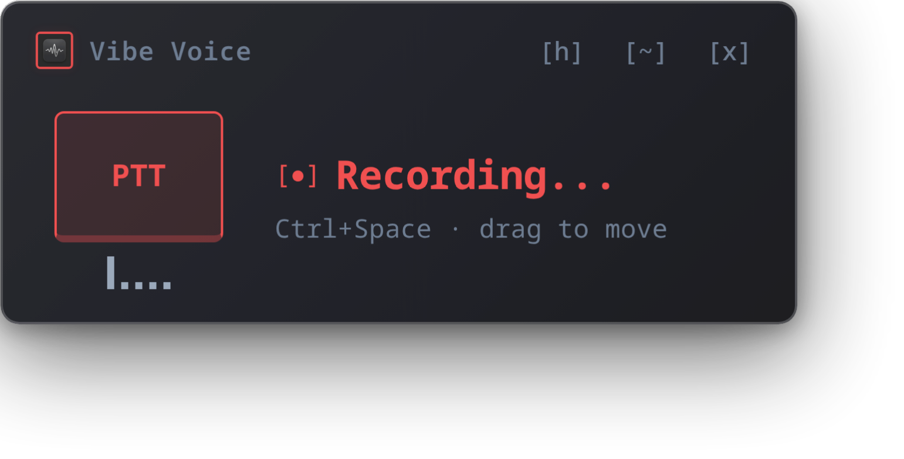
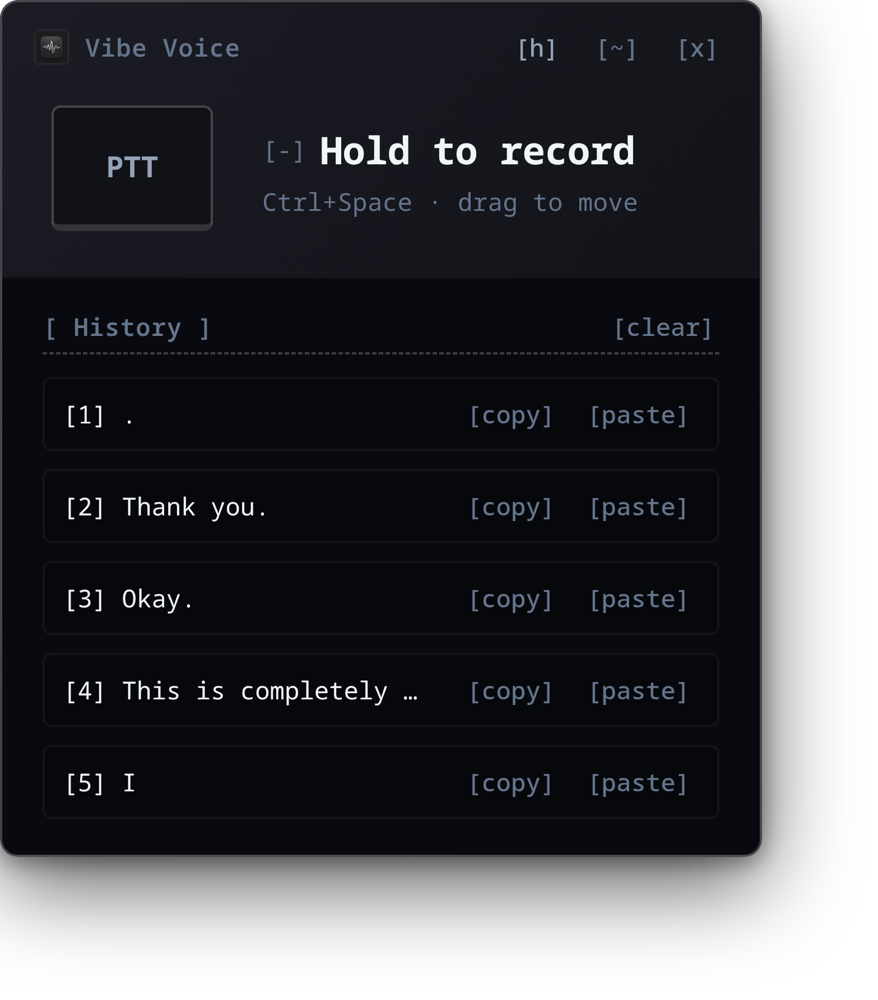
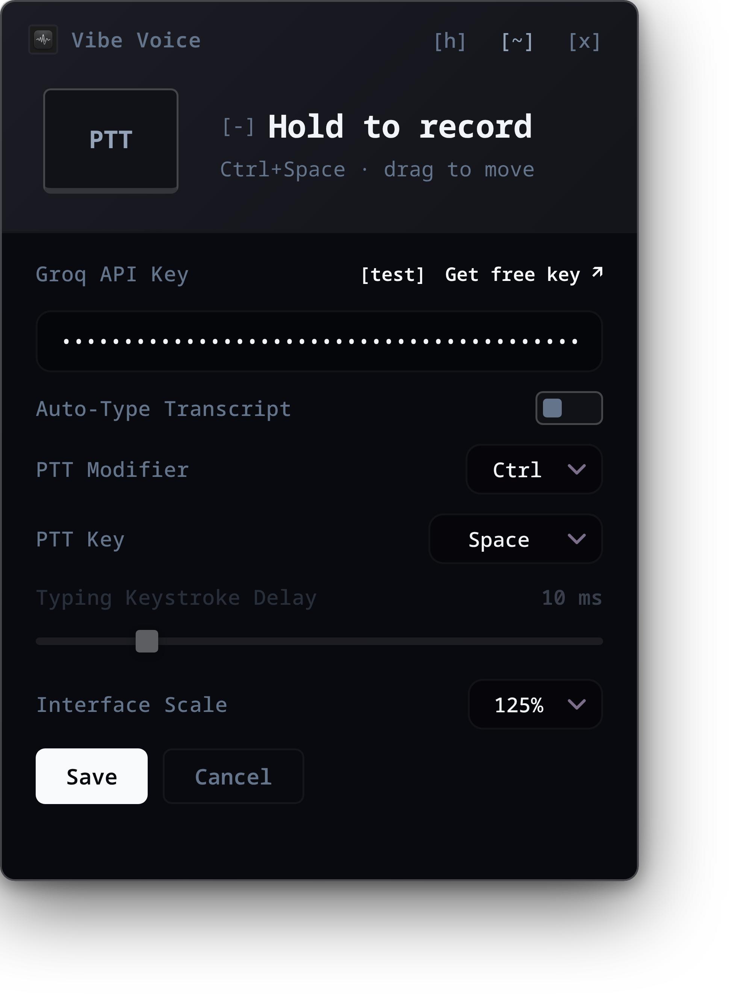

https://github.com/user-attachments/assets/53cf2d33-84a0-4230-90f7-b98e6514da6b


https://github.com/user-attachments/assets/3e7d8776-394f-4af9-95df-733c3f24763e

# Vibe Voice

> A push-to-talk speech-to-text widget for Linux/Wayland and Windows. Hold a button, speak, release — transcript lands in your active window.

[](https://github.com/TraiNguyenVan/vibe-voice/releases)
[](https://github.com/TraiNguyenVan/vibe-voice/actions)


https://github.com/user-attachments/assets/99b4cbb6-a61b-4a9b-9b31-bf0aa1b8dece


<p align="center">
  
  
  
</p>

---

## Features

- **Push-to-talk** — hold a mic button or a configured global hotkey (default **Ctrl+Space**), release when done
- **Groq Whisper** — lightning-fast speech-to-text via `whisper-large-v3-turbo`
- **Auto-paste & Toggle** — transcript is automatically pasted into your active window (via `ydotool` on Linux, `SendInput` on Windows). Can be toggled off to only copy to the clipboard.
- **Typing Keystroke Delay** — customize simulated typing speed (1ms to 50ms keystroke delay) directly in Settings to match your system's response rate.
- **Transcript History** — view, copy, or re-paste recent transcripts in a sleek monospaced history panel.
- **Custom Hotkeys** — pick custom modifier (Ctrl/Alt/Shift/None) and trigger keys in Settings.
- **Interface Scaling** — scale the UI from 80% to 150% directly inside Settings for accessibility.
- **Tray icon feedback** — red while recording, green flash when done.
- **Always-on-top widget** — small, transparent, no decorations, stays out of your way.
- **Private API key** — set your own Groq key via the Settings panel, stored in localStorage. Click the in-app link to quickly get a free Groq key.
- **Fedora-first** — one-shot setup script included (`ydotool-setup.sh`)

---

## Quick Install

### Windows

1. Download the latest installer executable `vibe-voice-setup.exe` from the [Releases](https://github.com/TraiNguyenVan/vibe-voice/releases) page.
2. Run the installer and launch the application.

### Fedora (RPM)

```bash
# One-time dependency setup
bash ydotool-setup.sh

# Install the app
sudo dnf install ./vibe-voice-*.x86_64.rpm
```

### Debian / Ubuntu (DEB)

```bash
# Install dependencies
sudo apt install ydotool pulseaudio-utils wl-clipboard

# Start the ydotool daemon
sudo /usr/bin/ydotoold --socket-path=/tmp/.ydotool_socket --socket-own=$(id -u):$(id -g) &

# Install the app
sudo apt install ./vibe-voice_*.deb
```

> **Note:** Vibe Voice is tested and verified to run on **Fedora** (Wayland/GNOME/Hyprland) and **Ubuntu** (GNOME).

---

## First Run

1. Launch **Vibe Voice** from your app menu / start menu or run `vibe-voice`
2. Click the settings button `[~]` in the titlebar
3. Paste your Groq API Key (obtain one via the in-app settings link or from [console.groq.com/keys](https://console.groq.com/keys))
4. Customize your hotkeys, toggle auto-type, adjust typing delay (1–50ms), and UI scale if desired
5. Click **Save** — key and settings persist in local storage

---

## Usage

| Action | Result |
|---|---|
| Hold mic button (or configured hotkey) | Recording starts, tray icon turns red |
| Release | Audio → Groq Whisper → clipboard → auto-pasted into active window |
| Tray icon flashes green | Transcription done and pasted |
| Click tray icon | Show / hide the widget |
| History `[h]` | Show / hide recent transcripts panel to copy or paste them |
| Settings `[~]` | Change and test API key, toggle auto-type, adjust typing delay, custom hotkeys, and UI scale |
| Click Settings in tray menu | Show widget and open Settings panel |

The widget displays a dynamic waveform visualizer while recording and automatically hides when transcription and auto-pasting are complete.

---

## Architecture

```
┌────────────────────────────────────────────────────────────────┐
┌───────────────────     Tauri 2 (Rust)     ─────────────────────┐
│                                                                │
│  Linux recording  →  parec (audio)                             │
│  Windows rec      →  cpal input stream                         │
│  stop_transcribe  →  Groq API → transcript                     │
│  Linux paste      →  wl-copy + ydotool type                    │
│  Windows paste    →  Clipboard + SendInput (Ctrl+V)            │
│  flash_tray_done  →  tray icon swap (2s)                       │
│  evdev (Linux)    →  global hotkey background thread           │
│  Hook (Windows)   →  low-level keyboard hook background thread │
└──────────────┬─────────────────────────┬───────────────────────┘
               │ invoke()                │ emit events
               ▼                         ▼
┌────────────────────────────────────────┐
│         Frontend (vanilla JS)          │
│         src/                           │
│         ├── index.html                 │
│         ├── main.js                    │
│         └── style.css                  │
└────────────────────────────────────────┘
```

---

## Project Structure

```
vibe-voice/
├── src/                        # Frontend (no bundler)
│   ├── index.html
│   ├── main.js
│   ├── style.css
│   └── logo.png                # TUI-style app logo (16x16px)
├── src-tauri/
│   ├── src/
│   │   ├── lib.rs              # All Tauri commands + app entry
│   │   └── main.rs             # Delegates to lib.rs run()
│   ├── icons/                  # App + tray icons
│   ├── capabilities/
│   │   └── default.json        # Tauri 2 window permissions
│   ├── Cargo.toml
│   └── tauri.conf.json
├── LICENSE                     # MIT license
├── .github/workflows/
│   └── release.yml             # CI: build deb + rpm + exe on tag push
├── ydotool-setup.sh            # Fedora one-shot daemon setup
├── run.sh                      # pnpm tauri dev alias
├── .env                        # GROQ_API_KEY (gitignored)
├── design.md                   # UI design guidelines (font, palette, elements)
├── AGENTS.md                   # AI agent instructions (gotchas, commands)
└── package.json
```

---

## Building from Source

```bash
pnpm install
pnpm tauri build
```

Output:

| Format | Path | OS |
|---|---|---|
| `.deb` | `src-tauri/target/release/bundle/deb/` | Linux |
| `.rpm` | `src-tauri/target/release/bundle/rpm/` | Linux |
| `.exe` | `src-tauri/target/release/bundle/nsis/` | Windows |

### Development

```bash
./run.sh           # pnpm tauri dev
pnpm run dev       # alias
```

---

## Requirements

### Linux
| Tool | Package | Purpose |
|---|---|---|
| `parec` | `pulseaudio-utils` | Audio recording (PipeWire-compatible) |
| `wl-copy` | `wl-clipboard` | Wayland clipboard write |
| `ydotool` | `ydotool` | Types characters into the focused window via evdev |
| `ydotoold` | (daemon) | Background daemon; user needs `input` group |
| `/dev/input/event*` | (devices) | Keyboard events for global hotkeys; user needs `input` group |
| `pnpm` | — | Node.js package manager |
| Rust/Cargo | — | Compiling the Tauri backend |

### Windows
- No external runtime dependencies required (capturing and pasting are handled natively via Win32 APIs).

---

## Technical Details

### Frontend Architecture (No Bundler)

The frontend is built using static files. Tauri APIs are accessed via the `window.__TAURI__` global object, bypassing the need for a bundler like Vite or Webpack.

### Audio Recording

- **Linux:** WebKitGTK blocks `getUserMedia()` on Wayland. Audio is recorded via a `parec` subprocess spawned from Rust:
  ```bash
  parec --channels=1 --rate=16000 --format=s16le --file-format=wav /tmp/vibe-voice-rec.wav
  ```
- **Windows:** Captured using the native `cpal` crate, recording directly from the default input device and saving to `Temp/vibe-voice-rec.wav` using `hound`.

### Tray Icon States

| State | Icon | Duration |
|---|---|---|
| Idle | Default tray icon | Until recording |
| Recording | Red icon | Recording duration |
| Done | Green icon | 2 seconds, then reverts to idle |

### Auto-paste Flow

If **Auto-Type Transcript** is enabled in Settings, the full automation flow runs:

- **Linux (Character-by-Character):**
  1. `wl-copy` writes transcript to Wayland clipboard (safety net).
  2. Window hides to return focus to previous app.
  3. 300ms wait for compositor to refocus.
  4. `ydotool type --file -` types each character via evdev (using the configured keystroke delay).
  5. Window stays hidden.
- **Windows (Clipboard + Simulated Paste):**
  1. Writes text to the Windows Clipboard as Unicode.
  2. Window hides to restore focus.
  3. 300ms wait.
  4. Simulates a `Ctrl+V` key sequence using `SendInput` FFI call.
  5. Window stays hidden.

If **Auto-Type Transcript** is disabled:
- The transcript is written to the system clipboard and the window is hidden (steps 1 and 2), allowing you to manually paste the text wherever you want via `Ctrl+V`.

### Global Hotkeys

- **Linux:** Monitored by a background thread reading `/dev/input/event*` keyboard devices directly (evdev), bypasses compositor-specific hotkey engines.
- **Windows:** Managed via a standard low-level Windows keyboard hook (`WH_KEYBOARD_LL`), filtering out injected inputs to prevent infinite loops during paste simulations.

### Socket Discovery for RPM (Linux)

When launched from a `.desktop` file, `YDOTOOL_SOCKET` isn't set. The `find_ydotool_socket()` helper in `lib.rs` auto-discovers the socket by:
1. Checking `$YDOTOOL_SOCKET` env var
2. Scanning `/proc/*/cmdline` for `ydotoold --socket-path`
3. Probing common paths (`/tmp/.ydotool_socket`, `/run/user/*/.ydotool_socket`)

---

## License

MIT
